  

 

> I build tools that help improve workflows,
> and I keep the computers, networks and servers those tools run on working.

 

 

## Table of Contents

- [DensePack](#densepack)
- [Xanini](#xanini)
- [DataPeel](#datapeel)
- [VtG](#vtg)
- [In production](#in-production)
- [Certifications](#certifications)

 

---

 

## DensePack

DensePack packs images of text that cost on average ~50% less compared to the raw text. 

The plugin was built to save across entire Claude Code sessions with Fable 5.1 and Opus 5 as the lead. Not just input tokens. 

| Repository                                                                                                       | Demo                                                                                                                                                                                | Description                                                                                                                                                                                                              | Source                                                                                     |
| ---------------------------------------------------------------------------------------------------------------- | ----------------------------------------------------------------------------------------------------------------------------------------------------------------------------------- | ------------------------------------------------------------------------------------------------------------------------------------------------------------------------------------------------------------------------ | ------------------------------------------------------------------------------------------ |
| [DensePack plugin](https://github.com/Fabian-Galvez/DensePack)                                                   | Plugin for Claude Code   Run: `/plugin marketplace add Fabian-Galvez/DensePack`  Then: `/plugin install densepack@densepack-marketplace`                       | Plugin that automatically packs the files your agent reads, long command output, the briefs it sends out and the reports subagents send back into DensePack images. Fable 5.1 and Opus 5 agents read them at about half the tokens of the text.                                   | [hooks.json](https://github.com/Fabian-Galvez/DensePack/blob/main/plugin/hooks/hooks.json) |
| [DensePack right-click tool](https://github.com/Fabian-Galvez/DensePack/tree/main/tools)  Windows, Linux and macOS  | Install required                                                                                                                                                                    | Right-click tool packs highlighted text and selected files into DensePack images via a right-click context menu and keyboard shortcuts.                                                                                  | [densepack.py](https://github.com/Fabian-Galvez/DensePack/blob/main/tools/densepack.py)    |
| [DensePack HTML app](https://github.com/Fabian-Galvez/DensePack)                                              | [Try it](https://fabian-galvez.github.io/DensePack/)                                                                                                                             | Turns pasted text into the smallest image an AI model can still read.   Sending a condensed image of text instead of the raw text uses about 50% fewer input tokens. | [index.html](https://github.com/Fabian-Galvez/DensePack/blob/main/index.html)              |

 

---

 

## Xanini

Most customizable .svg files for GitHub are linked dependencies which means that if the server they live on goes down, your .svg files stop rendering. 

Xanini allows you to make unique custom .svg files and animations that are yours to keep. Upload them to GitHub and they sit in your repository so you never have to worry about your .svg banner failing when a visitor stops by your GitHub.  

| Repository                                        | Description                                                                                                                                            | Demo                                                  | Source                                                                     |
| ------------------------------------------------- | ------------------------------------------------------------------------------------------------------------------------------------------------------ | ----------------------------------------------------- | -------------------------------------------------------------------------- |
| [Xanini](https://github.com/Fabian-Galvez/Xanini) | SVG studio that makes .svg icons, banners and animations that render on GitHub, all from your browser.   The files you create are yours to keep. | [Try it](https://fabian-galvez.github.io/Xanini/)  | [index.html](https://github.com/Fabian-Galvez/Xanini/blob/main/index.html) |

> [!WARNING]
> <strong>This is a personal project. It is still in development and far from perfect or finished.</strong>  
> 
> That being said, <strong>it works</strong> and has produced every .svg file/animation that you see rendered throughout the live repositories, including the banner at the top of this README.

Download the index.html to run locally and offline.

 

---

 

## DataPeel

| Repository                                            | Description                                                                                                                                        | No install               | Source                                                                                       |
| ----------------------------------------------------- | -------------------------------------------------------------------------------------------------------------------------------------------------- | ------------------------ | -------------------------------------------------------------------------------------------- |
| [DataPeel](https://github.com/Fabian-Galvez/DataPeel) | Wipes the metadata of every image in its folder with one click, and shows the data that can identify you in each image, before and after the wipe. | Windows EXE file Linux and macOS run from source | [metadata_wipe.py](https://github.com/Fabian-Galvez/DataPeel/blob/main/src/metadata_wipe.py) |

 

---

 

## VtG

| Repository                                  | Description                                                                                                                                                                                 | No install                   | Source                                                                            |
| ------------------------------------------- | ------------------------------------------------------------------------------------------------------------------------------------------------------------------------------------------- | ---------------------------- | --------------------------------------------------------------------------------- |
| [VtG](https://github.com/Fabian-Galvez/VtG) | Turns every screen recording in its folder into a gif. One tab per video, sliders for frames, quality and width, a live size estimate. (The demo gifs in these repos were made with VtG) | Windows EXE file Linux and macOS run from source | [vid_to_gif.py](https://github.com/Fabian-Galvez/VtG/blob/main/src/vid_to_gif.py) |

 

---

 

## In production

The first Python app that I made to solve a real workflow issue. 

Basic Python tkinter application built to improve an Aerospace part manufacturer's QA team's workflow for consolidating CNC machined part measurements from specific columns in the workbooks they received. A task that took the team hours now takes them 5 minutes to complete. 
 
Delivered September 2025. Runs daily in production with zero support tickets raised against it.

 

| App repo                                          | Description                                                                                            | Source                                                                           |
| ------------------------------------------------- | ------------------------------------------------------------------------------------------------------ | -------------------------------------------------------------------------------- |
| [xGator](https://github.com/Fabian-Galvez/xGator) | Pulls the columns you choose out of Excel workbooks (.xlsx) and gathers them into one master workbook. | [aggregator.py](https://github.com/Fabian-Galvez/xGator/blob/main/aggregator.py) |

 
The version in this repo is much more versatile and works on any column.

 

---

 

## Certifications

| Credential                                 | Issuer              |
| ------------------------------------------ | ------------------- |
| CompTIA A+                                 | CompTIA             |
| Google IT Support Professional Certificate | Google, on Coursera |

 

---

[LinkedIn](https://www.linkedin.com/in/fabian-gz/)
